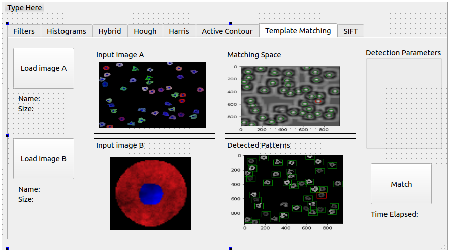
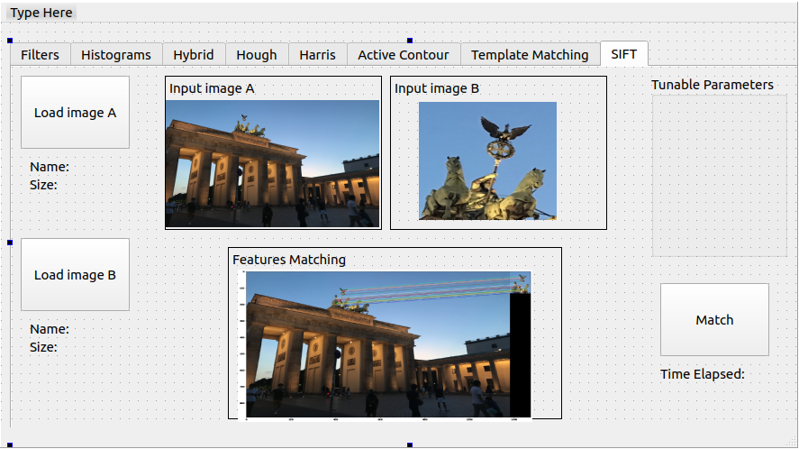

## Objectives

* Apply Template Matching method using different similarity metrics.
* Apply SIFT and matching images with different rotations and scales.
* Reporting results and computation times.

## Deadline

**Thursday 16/4/2020 11:59 PM**

## Joining to Assignment Repository
Refer to this sheet to know your **Group number**: (https://docs.google.com/spreadsheets/d/1H0mGNnDtruLanYVxQH6439rXLTpPglXzglBmYt1J_ow/edit?usp=sharing)

1. Register your team in the assignment through https://classroom.github.com/g/pLAsu9oN. 

2. Join your team that you already worked with in the previous assignment

## Deliverables

You will start working from the source code you delivered for previous task.

Only one member in each team will do the following:

1. First, copy the remote url of the newly generated repository.

2. From the folder of the previous repository, upload the source to the new repository.
For example, for team SBE404-2020-Team01, in the folder of the previous task, the responsible member may run the following command:

   ``git push git@github.com:sbme-tutorials/cv404-2020-assignment-02-sbe404-2020-team01.git master -u``

Now you will find your work of the previous task uploaded to the new repository. Now clone the new repository in an independent folder.

### A) Computer Vision Functions

You need to implement Python functions which will support the following tasks:

1. Match the image set features using:
    1. Correlation
    2. Zero-mean correlation
    3. Sum of squared differences (SSD)
    4. and normalized cross correlations.**Then report matching computation time in the GUI.**

2. Generate feature descriptors using scale invariant features (SIFT).**Report computation time in the GUI.**

You should implement these tasks **without depending on OpenCV library or alike**.

Add new Python files to organize your implementation of the core functionalities:

1. `CV404Template.py`: this will include the implementation for template matching functions (requirement 1). You can use the distance functions from the section as they are. Develop your own methods to extract the similar objects.
2. `CV404SIFT.py`: this will include the implementation for SIFT technique (requirement 2). Gather the pieces of codes in the notebook in an organized Python class.

### B) GUI Integration

Integrate your functions in part (A) to the following Qt MainWindow design:

| Tab 7 |
|---|
|  |

| Tab 8 |
|---|
|  |